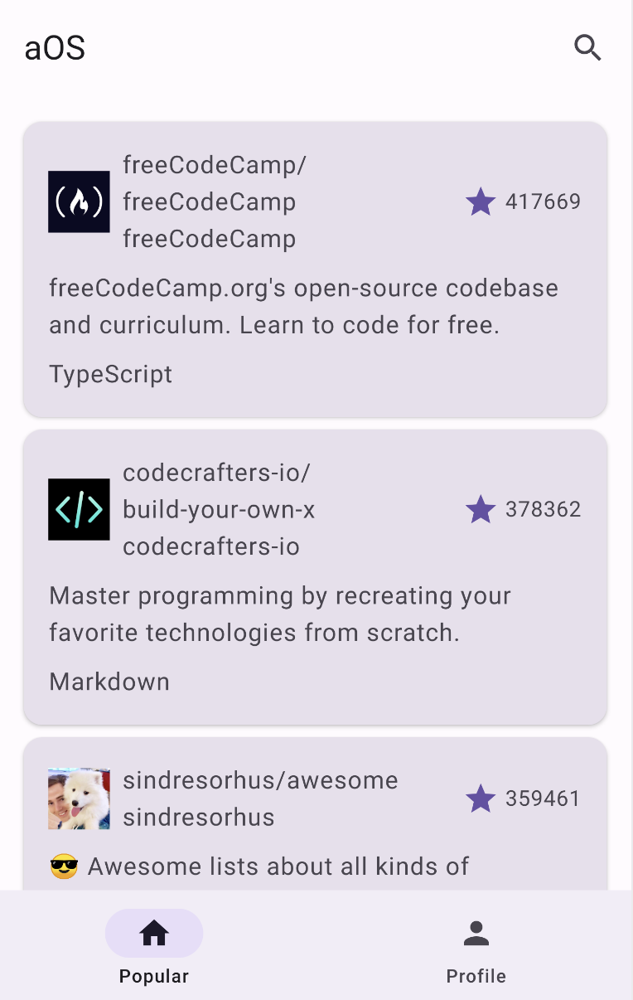

# aOS Github App

This app uses a test token to access Github REST apis and buids a very simple Github client based on these apis. The features include:

- Popular Repos
- My Repos
- Search Repos
- Login
- Logout
- Raise Issue

## Architecture

The project is three-layered. 

The login and raise issue flow:

## Screenshots

### Home
Popular eepos

My Profile and repos

### Repo
Repo detail

Raise an Issue

Search repos

## Login

