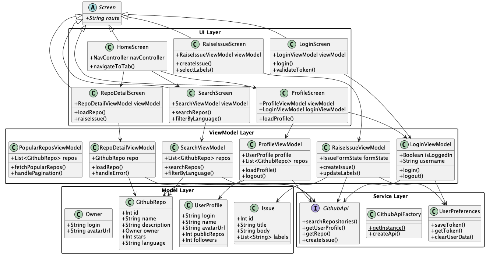

# aOS Github App

This app uses a test token to access Github REST apis and buids a very simple Github client based on these apis. The features include:

- Popular Repos
- My Repos
- Search Repos
- Login
- Logout
- Raise Issue

## Architecture

## Screenshots

